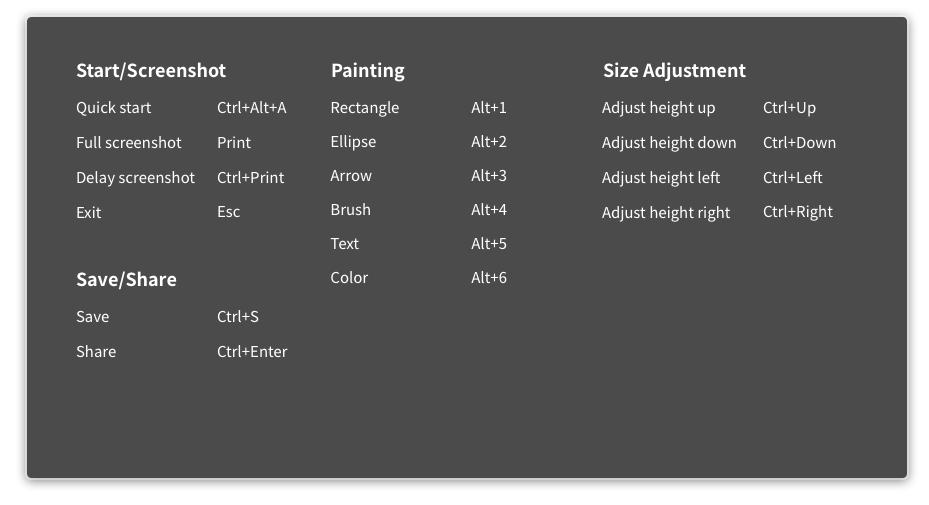
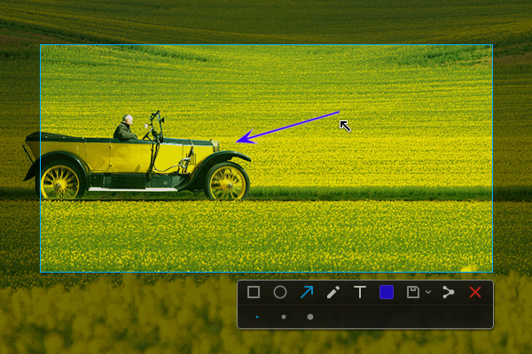
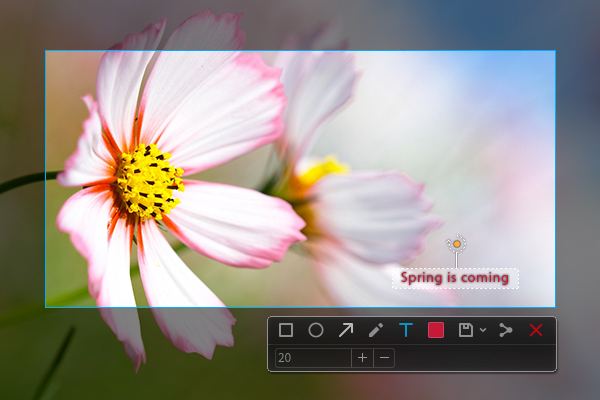

# Deepin Screenshot|deepin-screenshot.svg|
## Overview|overview.svg|
Deepin Screenshot is a screenshot tool that comes with deepin operating system and developed by Wuhan Deepin Technology Co., Ltd. In our daily work and entertainment, in order to demonstrate the program interfaces, application scenarios, and so on in particular states, we need to capture the visual images which can be displayed on screens or other display devices. At this time, you can achieve it by running the application of Deepin Screenshot.

Deepin Screenshot has the two photo editing features—Blurring and Mosaic, which helps protect your private information in the process of your spreading pictures, and supports rich social networking platform to let you interact with your friends anywhere and anytime and share the wonders around you!

 

You have several ways to achieve quick screenshot:

* Using the  key on the keyboard to capture the entire display screen.

* Using the screenshot function of various applications such as Tencent QQ, chrome browser and other software.

* Using professional software to capture screens, such as the application Deepin Screenshot that comes with Deepin operating system.

## Basic Operations|basic-operation.svg|
### Running Deepin Screenshot
You can do one of the following operations to run Deepin Screenshot. After you enter the screenshot mode, the computer screen will go dark.

* If you have fixed Deepin Screenshot to your desktop, on your desktop, click on . 

* If you have fixed Deepin Screenshot to Dock, click on .

*  On Dock, click on  to enter the interface of Launcher. By browsing, you can find . Then click on it. 

* Press the ++ key combination on your keyboard to quickly run Deepin Screenshot.

### Delay Screenshot

Delay Screenshot reserves 5 seconds for you to prepare, which helps you capture the precise moments.

> **Attention：** If you have pinned Deepin Screenshot onto Dock, right-click on  on Dock, and then select ** Delay 5s** to delay the capturing.

You can also operate the following steps to achieve delay screenshot:

1. Pressing the + key combination on the keyboard.

2. In the upper right corner of the screen, you will see the message "Deepin Screenshot will start after 5 seconds". 

3. You can automatically enter the screenshot mode after waiting for 5 seconds, and then the entire screen goes dark.

### Exit Deepin Screenshot

In screenshot mode, you can exit Deepin Screenshot through one of the following two ways:

* Pressing the  key on your keyboard.

* Clicking the right mouse button to exit screenshot mode.

## Shortcut Keys|shortcut-key.svg|
To do the related operations through shortcut keys can save you time and efforts.

### View Shortcut Keys

1. In the screenshot mode, pressing the ++ key combination to open shortcut keys preview interface.

2. In shortcut keys preview interface, you can view all of the shortcut keys.

<table class="block2">
    <caption>Start/Screenshot</caption>
    <tbody>
        <tr>
            <td>Quick start</td>
            <td>Ctrl+Alt+A</td>
        </tr>
        <tr>
            <td>Full screenshot</td>
            <td>Print</td>
        </tr>
        <tr>
            <td>Delay screenshot</td>
            <td>Ctrl+Print</td>
        </tr>
        <tr>
            <td>Exit</td>
            <td>Esc</td>
        </tr>
        <tr>
            <td>&nbsp;</td>
            <td>&nbsp;</td>
        </tr>
        <tr>
            <td>&nbsp;</td>
            <td>&nbsp;</td>
        </tr>
    </tbody>
</table>
<table class="block2">
    <caption>Painting</caption>
    <tbody>
        <tr>
            <td>Rectangle</td>
            <td>Alt+1</td>
        </tr>
        <tr>
            <td>Ellipse</td>
            <td>Alt+2</td>
        </tr>
        <tr>
            <td>Arrow</td>
            <td>Alt+3</td>
        </tr>
        <tr>
            <td>Brush</td>
            <td>Alt+4</td>
        </tr>
        <tr>
            <td>Text</td>
            <td>Alt+5</td>
        </tr>
        <tr>
            <td>Color</td>
            <td>Alt+6</td>
        </tr>
    </tbody>
</table>
<table class="block2">
    <caption>Size adjustment</caption>
    <tbody>
        <tr>
            <td>Adjust selection height up</td>
            <td>Ctrl+Up</td>
        </tr>
        <tr>
            <td>Adjust selection height down</td>
            <td>Ctrl+Down</td>
        </tr>
        <tr>
            <td>Adjust selection height left</td>
            <td>Ctrl+Left</td>
        </tr>
        <tr>
            <td>Adjust selection height right</td>
            <td>Ctrl+Right</td>
        </tr>
    </tbody>
</table>
<table class="block2">
    <caption>Save/Share</caption>
    <tbody>
        <tr>
            <td>Save</td>
            <td>Ctrl+S</td>
        </tr>
        <tr>
            <td>Share</td>
            <td>Ctrl+Enter</td>
        </tr>
        <tr>
            <td>&nbsp;</td>
            <td>&nbsp;</td>
        </tr>
        <tr>
          <td>&nbsp;</td>
          <td>&nbsp;</td>
        </tr>
    </tbody>
</table>

## Select Screenshot Area|select-screenshot-area.svg|

Currently there are three commonly used screenshot ways: full screenshot, program window screenshot and optional area screenshot. When you select the range to be captured, there will be a blue border around the screenshot area, and this area will restore highlighted display.

> **Attention：** When the computer is in multi-screen display mode, you can use Deepin Screenshot to capture the information on different screens.

### Full Screenshot

Full screenshot is capturing the entire screen of the current display automatically.

* If you have pinned Deepin Screenshot onto Dock, right-click on on Dock, and then select **Full screenshot** to capture the entire screen.  

* Pressing the  key on the keyboard to achieve full screenshot.

You can also achieve the full screenshot by operating the following steps:

1. Press the ++ key combination on the keyboard to enter the screenshot mode.

2. Move the mouse pointer onto the desktop and Deep Screenshot will select the entire screen automatically and shows the size of the current screenshot area in its upper left corner.

3. Click on the desktop and in the upper right corner of the desktop the toolbar will pop up.

4. If you want to exit screenshot, please click on  on the toolbar or click the right mouse button and select **Exit**.

### Program Window Screenshot
Program Window Screenshot is capturing the entire window after automatically recognizing the current application window.

1. Press the ++ key combination on the keyboard to enter the screenshot mode.

2. Move the mouse pointer onto the open application window and Deep Screenshot will select the window automatically and shows the size of the current screenshot area in its upper left corner.

3. Click on the window and in the lower right corner of the window the toolbar will pop up.

4. If you want to exit screenshot, please click on  on the toolbar or click the right mouse button and select **Exit**.

### Optional Area Screenshot
Optional Area Screenshot is the screenshot way of freely choosing the range to be captured by dragging the mouse.

1. Press the ++ key combination on the keyboard to enter the screenshot mode.

2. Press and hold down the left mouse button, and drag the mouse to select the screenshot area, the size of the current screenshot area will be displayed in real time in its upper left corner.

3. Release the left mouse button to finish capturing screenshot, and then the toolbar will pop up in the right corner of the screenshot area.

4. If you want to exit screenshot, please click on  on the toolbar or click the right mouse button and select **Exit**.

## Adjust Screenshot Area|adjust-screenshot.svg|

You can do fine adjustment to the screenshot area, for example, enlarging or reducing the scope to be captured, moving the screenshot, and so on.

### Enlarging / Reducing Screenshot Area
Position the mouse pointer over the blue border of the screenshot area, and then the mouse pointer will become  and the border will become a point-like edge. You can: 

* Press and hold down the left mouse button, and drag the mouse to enlarge or reduce the screenshot area.

* Press + or  on the keyboard to extend the screenshot area up or down, and press + or  on the keyboard to extend the screenshot area left or right.

### Move Screenshot
Position the mouse pointer over the screenshot area, and then the mouse pointer will become .You can:

* Press and hold down the left mouse button, and drag the mouse to move the screenshot area.

* Press  or  on the keyboard to move the screenshot area up or down, and press  or  on the keyboard to move the screenshot area left or right.

## Edit Screenshot|edit-screenshot.svg|
The image editing features that come with Deepin Screenshot, including graphics marking and text annotation, etc, can fully meet your daily needs of processing images. You can also mosaic the images to protect your privacy.

You can do one of the following operations to edit screenshots:

* Click on the tool icons on the toolbar to edit.

* Quickly switch between the various editing tools through the shortcut keys.

* Click the right mouse button to choose the editing tool after selecting the screenshot area.

### Toolbar Description 
In the screenshot process, you can click on the icons on the toolbar to complete the related operations. When you run Deepin Screenshot and select the screenshot area with the mouse, the toolbar will automatically appear at the bottom of the screenshot.

> **Attention：** If you have already set the extended panel of the toolbar, such as line thickness, font size and so on, Deepin Screenshot will remember your choice. When you start Deepin Screenshot next time, this setting will be used by default. You can also choose again.

<table class="block1">
    <caption>Icon Description</caption>
    <tbody>
        <tr>
            <td></td>
            <td>Rectangle</td>
            <td class="blank"></td>
            <td></td>
            <td>Ellipse</td>
			<td class="blank"></td>
            <td></td>
            <td>Save</td>
        </tr>
          <tr>
            <td></td>
            <td>Arrow</td>
            <td class="blank"></td>
            <td></td>
            <td>Text</td>
            <td class="blank"></td>
            <td></td>
            <td>Share</td>
        </tr>
        <tr>
            <td></td>
            <td>Brush</td>
            <td class="blank"></td>
            <td></td>
            <td>Color</td>
            <td class="blank"></td>
            <td></td>
            <td>Exit</td>
        </tr>
    </tbody>
</table>

### Drawing Graphics
In the images that are captured, you can draw some simple graphics, such as rectangle, ellipse, and so on.

 

#### Rectangle

1. In the toolbar below the screenshot area, click on .

2. In the extended panel of the toolbar, choose thickness of the rectangle border line. 

3. Place the mouse pointer on the screenshot area, and then the mouse pointer will become .

4. Press and hold down the left mouse button, drag the mouse to finish choosing the graphic area.

5. If the screenshot includes the personal private information, please click on  or  in the extended panel of the toolbar to blur.

#### Ellipse

1. In the toolbar below the screenshot area, click on .

2. In the extended panel of the toolbar, choose thickness of the ellipse border line.

3. Place the mouse pointer on the screenshot area, and then the mouse pointer will become .

4. Press and hold down the left mouse button, drag the mouse to finish choosing the graphic area.

5. If the screenshot includes the personal private information, please click on  or  in the extended panel of the toolbar to blur.

#### Arrow

1. In the toolbar below the screenshot area, click on .

2. In the extended panel of the toolbar, choose thickness of the arrow border line.

3. Place the mouse pointer on the screenshot area, and then the mouse pointer will become .

4. Press and hold down the left mouse button, drag the mouse to finish choosing the graphic area.

#### Brush

1. In the toolbar below the screenshot area, click on .

2. In the extended panel of the toolbar, choose thickness of the brush.

3. Click on , and switch between the free brush and the linear brush.

4. Place the mouse pointer on the screenshot area, and then the mouse pointer will become .

5. Press and hold down the left mouse button, drag the mouse to finish choosing the graphic area.

> **Attention：** If you want to draw graphics like square, circle, you can:  

  * Press and hold the  key on your keyboard, and then select  to draw a square.
  * Press and hold the  key on your keyboard, and then select  to draw a circle.
  * Press and hold the  key on your keyboard, and then select  to draw an arrow in the horizontal or vertical direction.
  * Press and hold the  key on your keyboard, and then select  to draw straight lines in the horizontal or vertical direction.

### Modify Graphics
If you’ve drawn other graphics in the screenshots, you can modify and move the drawn graphics.

#### Move Graphics
1. Position the mouse pointer over the sideline of the graphics, and then the mouse pointer become .

2. Press and hold down the left mouse button, and you can move the graphics to any place in the screenshot area.

3. Press + or  on the keyboard to extend graphics area up or down, and press + or  on the keyboard to extend graphics area left or right.

4. Press  or  on the keyboard to move graphics up and down, and press  or  on the keyboard to move graphics left and right.

#### Edit Graphics
1. Position the mouse pointer over the sideline of graphics.

2. Click the left mouse button to enter the editing mode of graphics. You can:

   - Press the  key on the keyboard to delete graphics.
   
   - Press the + keys on your keyboard to return to the previous step. 
   
   - Position the mouse pointer on the editing box, and then the mouse pointer becomes . You can enlarge or reduce the graphics area by dragging the mouse pointer.  
   
   - Position the mouse pointer on  of the editing box, and then the mouse pointer becomes . You can rotate graphics by dragging the mouse pointer .
   
3. Click the left mouse button outside the editing box to exit the editing mode. 

### Add Text Annotations 
To give text supplement and descriptions to the images that are captured to help others understand them more clearly.

1. In the toolbar below the screenshot area, click on .

2. In the extended panel of the toolbar, enlarge or reduce the font size of the annotation by entering the font size or through clicking on  or .

3. Place the mouse pointer on the images that are captured, and then the mouse pointer becomes .

4. Click where you want to add an annotation, and a text box to be input will appear.

5. Enter text in the text box.

### Modify Text Annotations 
If you have added a text annotation, you can modify and move the text annotation.

#### Move Text Annotations
1. Position the mouse pointer over the text, and then the mouse pointer becomes .

2. Press and hold down the left mouse button, and you can move the text to any place in the screenshot area.

3. Press + or  on the keyboard to extend the text box up or down, and press + or  on the keyboard to extend the text box left or right.

4. Press  or  on the keyboard to move the text box up or down, and press  or  on the keyboard to move the text box left or right.

#### Edit Text Annotations
1. Position the mouse pointer over the text.

2. Click the left mouse button to enter text-editing mode. You can: 

   - Press the  key on the keyboard to delete the text annotations.
   
   - Press the + keys on your keyboard to return to the previous step. 
   
   - Modify the text messages in the text box.
   
   - Position the mouse pointer on  of the text box, and then the mouse pointer becomes . You can rotate the text annotation by dragging the mouse pointer .
   
3. Click the left mouse button outside the text box to exit the editing mode.

### Set Marker Colors
Deepin Screenshot totally provides 16 colors for you to choose from. You can choose different colors for different graphical indicators.

1. In the toolbar below the screenshot area, click on .

2. Select a color in the extended panel of the toolbar.

## Save Screenshot|save-screenshot.svg|
To save the images that are captured, to store materials for the subsequent use! 

After the screenshot is saved successfully, you can see the message on the upper right corner of the desktop. Click on **View**, and you can open the folder where your screenshot is in.  

You can save the images that are captured by doing one of the following operations:

* Press the + key combination on the keyboard to save.

* Press the  key on the keyboard to save directly.

* In the images that are captured, click the right mouse button and select **Save** or double-click the mouse to complete the operation of “save”.

> **Attention：** In the above operations, the images that are captured are stored in the picture folder of the system by default.

You can also click the drop-down options of  in the toolbar below the screenshot area:

* Select  to save the picture under the system default picture folder.

* Select  to save the picture to your desktop.

* Select  to save the picture to your specified storage path.

* Select  to copy the picture to the clipboard.

* Select  to save the picture under the system default picture folder and copy it to the clipboard.

* Adjust the quality of the saved pictures by dragging the slider left or right.   

## Share Screenshot|share-screenshot.svg|
You can capture funny pictures and write text to them. Then you can pass this happiness to your friends to make more people feel it! 

You can press the + key combination on the keyboard to quickly realize the sharing! You can also execute the following operations to share:

1. In the toolbar below the screenshot area, click on .

2. In the “share” interface, type in what you want to say and click on **Next**.

3. Select a social account and click on **Share**.

4. Log in to your social account authorization and share.

5. when sharing is successful, you can see the message in the upper right corner of the desktop.

6.  If sharing fails, please click on **Try Again** to share them again.

7. If you want to exit “Share”,please click on **Cancel** or **Close**.

> **Attention：** Please control the input text in 140 characters on “Share” interface. After you share a screenshot, Deepin Screenshot would remember your account and password to facilitate the sharing operations next time. 

Click on **Account Management** in the lower left corner on “Share” interface. You can manage multiple accounts: 

* Log out the login account.

* Use a new account to log in to share. 
