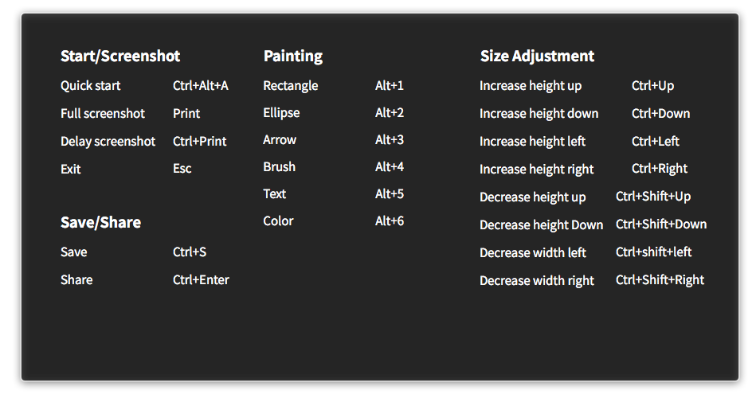
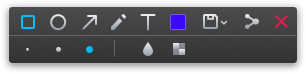
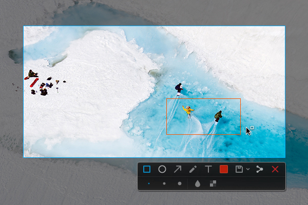
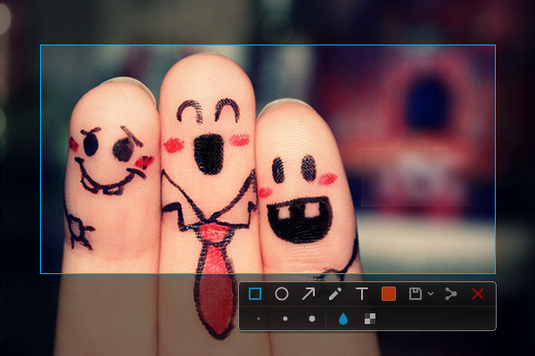
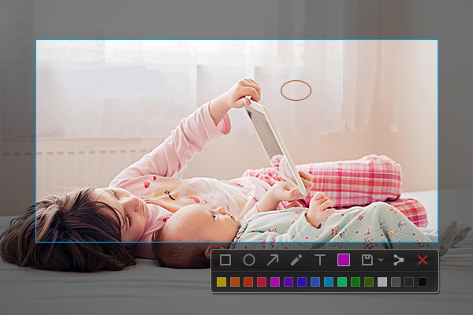
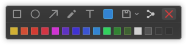
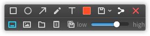
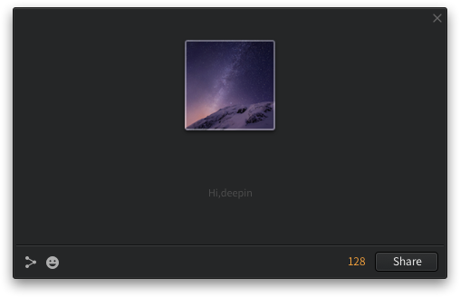

# Deepin Screenshot|../common/deepin-screenshot.svg|

## Overview|../common/icon_overview.svg|

Deepin Screenshot is a screen capturing tool that comes with deepin operating system and developed by Wuhan Deepin Technology Co., Ltd. In our daily work and entertainment, in order to demonstrate the program interface, application scenarios and so on of particular states, we need to capture the visual images which can be displayed on screens or other display devices. Now, you can achieve it by running the software of Deepin Screenshot.

Deepin Screenshot has blurring and mosaic features, which help protect your privacy during the spread of your pictures. And it supports rich social networking platforms which allows you to interact with your friends anywhere and anytime to share the wonders around you!

There are several ways to achieve a quick screenshot:

*  Press  on keyboard to capture the entire  screen.

* Use the screenshot function of various applications such as Tencent QQ, Chrome browser and others.

* Use professional software to capture screens, such as Deepin Screenshot built in deepin.

## Basic Operations|../common/icon_basicoperation.svg|

### Run Deepin Screenshot

You can do one of the following operations to run Deepin Screenshot. After you enter the screenshot mode, the computer screen will go dark.

*  On Dock, click on  to enter the interface of Launcher. By browsing, you can find  to click on.

* Press ++ on keyboard to quickly run Deepin Screenshot.

### Delay Screenshot

Delay screenshot reserves 5 seconds for you to prepare, which helps you to capture the most precise moments.

> : If you have fixed Deepin Screenshot on Dock, right click on  on Dock, and then select ** Delay screenshot** to delay the capturing.

You can also operate the following steps to delay screenshot:

1. Press + on keyboard.
2. In the upper right corner of the screen, you will see the prompt "Deepin Screenshot will start after 5 seconds".
3. It will automatically enter the screenshot mode after 5 seconds, and then the entire screen will go dark.

### Exit Deepin Screenshot

In screenshot mode, you can exit Deepin Screenshot through one of two ways:

* Press  on keyboard.

* Right click and select **Exit**.

## Shortcuts|../common/icon_shortcutkey.svg|

It will save you both time and efforts to operate with shortcuts.

1. In the screenshot mode, pressing the ++ key combination to open shortcut keys preview interface.
2. In the shortcuts preview interface, you can view all the shortcuts.

<table class="block2">

    <caption>Start/Screenshot</caption>

    <tbody>

        <tr>

            <td>Quick start</td>

            <td>Ctrl+Alt+A</td>

        </tr>

        <tr>

            <td>Full screenshot</td>

            <td>Print</td>

        </tr>

        <tr>

            <td>Delay screenshot</td>

            <td>Ctrl+Print</td>

        </tr>

        <tr>

            <td>Exit</td>

            <td>Esc</td>

        </tr>

        <tr>

            <td>&nbsp;</td>

            <td>&nbsp;</td>

        </tr>

        <tr>

            <td>&nbsp;</td>

            <td>&nbsp;</td>

        </tr>

    </tbody>

</table>

<table class="block2">

    <caption>Painting</caption>

    <tbody>

        <tr>

            <td>Rectangle</td>

            <td>Alt+1</td>

        </tr>

        <tr>

            <td>Ellipse</td>

            <td>Alt+2</td>

        </tr>

        <tr>

            <td>Arrow</td>

            <td>Alt+3</td>

        </tr>

        <tr>

            <td>Brush</td>

            <td>Alt+4</td>

        </tr>

        <tr>

            <td>Text</td>

            <td>Alt+5</td>

        </tr>

        <tr>

            <td>Color</td>

            <td>Alt+6</td>

        </tr>

    </tbody>

</table>

<table class="block2">

    <caption>Size adjustment</caption>

    <tbody>

        <tr>

            <td>Increase height up</td>

            <td>Ctrl+Up</td>

        </tr>

        <tr>

            <td>Increase height down</td>

            <td>Ctrl+Down</td>

        </tr>

        <tr>

            <td>Increase width left</td>

            <td>Ctrl+Left</td>

        </tr>

        <tr>

            <td>Increase width right</td>

            <td>Ctrl+Right</td>

        </tr>

        <tr>

            <td>Decrease height up</td>

            <td>Ctrl+Shift+Up</td>

        </tr>

        <tr>

          <td>Decrease height down</td>

          <td>Ctrl+Shift+Down</td>

        </tr>

        <tr>

            <td>Decrease width left</td>

            <td>Ctrl+Shift+Left</td>

        </tr>

        <tr>

          <td>Decrease width right</td>

          <td>Ctrl+Shift+Right</td>

        </tr>

    </tbody>

</table>

<table class="block2">

    <caption>Save/Share</caption>

    <tbody>

        <tr>

            <td>Save</td>

            <td>Ctrl+S</td>

        </tr>

        <tr>

            <td>Share</td>

            <td>Ctrl+Enter</td>

        </tr>

        <tr>

            <td>&nbsp;</td>

            <td>&nbsp;</td>

        </tr>

        <tr>

          <td>&nbsp;</td>

          <td>&nbsp;</td>

        </tr>

        <tr>

            <td>&nbsp;</td>

            <td>&nbsp;</td>

        </tr>

        <tr>

          <td>&nbsp;</td>

          <td>&nbsp;</td>

        </tr>

        <tr>

            <td>&nbsp;</td>

            <td>&nbsp;</td>

        </tr>

        <tr>

          <td>&nbsp;</td>

          <td>&nbsp;</td>

        </tr>

    </tbody>

</table>

## Select Screenshot Area|../common/icon_screenshotarea.svg|

Currently there are three areas commonly captured: the full screen, program-window and customized area. When you select the relevant area to be captured, there will be a blue border around the screenshot area and highlight display within.

> : When the computer is in multi-screen display mode, you can use Deepin Screenshot to capture areas on different screens.

### Full Screen Selection

Full screen selection is to recognize the complete screen of the current display.

You can select full screen by operating the following steps:

1. Press ++ on keyboard to enter the screenshot mode.
2. Move the mouse pointer onto the desktop and Deep Screenshot will select the entire screen automatically. The size of the current screenshot area will be in its upper left corner.
3. Click on the desktop and the toolbar will pop up in the upper right corner.
4. If you want to exit screenshot, please click on  on the toolbar or right click and select **Exit**.

You can also take a full screenshot by operating the following steps:

* If you have fixed Deepin Screenshot on Dock, right click on  on Dock, and then select **Full Screenshot**.

* Press the  on keyboard to achieve full screenshot.

### Program Window Selection

Program window selection is to automatically recognize the current application window.

1. Press ++ on keyboard to enter the screenshot mode.
2. Move the mouse pointer over the running application window. Deepin Screenshot will select the window automatically and shows the size of the current screenshot area in its upper left corner.
3. Click on the window, the toolbar will pop up in the lower right corner.
4. If you want to exit screenshot, please click on  on the toolbar or right click and select **Exit**.

### Area Customization

Area customization is to freely select the area to be captured by dragging the mouse.

1. Press ++ on keyboard to enter the screenshot mode.
2. Press and hold down the left mouse button, and drag the mouse to select the screenshot area. The size of the current screenshot area will be displayed in real time in its upper left corner.
3. Release the left mouse button to finish capturing screenshot, and then the toolbar will pop up in the lower right corner of the screenshot area.
4. If you want to exit screenshot, please click on  on the toolbar or right click and select **Exit**.

## Adjust Screenshot Area|../common/icon_adjustscreenshot.svg|

You can do fine adjustments to the screenshot area, for example, enlarging or reducing the scope to be captured, moving the screenshot, and so on.

### Enlarging / Reducing Screenshot Area

Position the mouse pointer over the blue border of the screenshot area, then the mouse pointer will become . You can:

* Press and hold down the left mouse button, and drag the mouse to enlarge or reduce the screenshot area.

* Press + or  on keyboard to extend the screenshot area up or down, and press + or  on keyboard to extend the screenshot area left or right.

### Move Screenshot

Position the mouse pointer over the screenshot area, and then the mouse pointer will become . You can:

* Press and hold down the left mouse button, and drag the mouse to move the screenshot area.

* Press  or  on keyboard to move the screenshot area up or down, and press  or  on keyboard to move the screenshot area left or right.

## Edit Screenshot|../common/icon_editscreenshot.svg|

The image editing features that come with Deepin Screenshot, including graphics marking and text annotation, etc, can fully meet your daily needs of processing images. You can also mosaic the images to protect your privacy.

You can do one of the following operations to edit screenshots:

* Click on the tool icons on the toolbar to edit.

* Quickly switch between various editing tools through the shortcuts.

* Right click to choose the editing tools after selecting the screenshot area.

### Toolbar Description

While capturing screenshots, you can click on the icons on the toolbar to complete various operations. Run Deepin Screenshot and select the screenshot area with the mouse, the toolbar will automatically appear below the screenshot area.

>: If you have already set line thickness, font size and so on for the extended panel of the toolbar, Deepin Screenshot will remember your choice. When you start Deepin Screenshot next time, the settings will be used by default. You can also choose again.

<table class="block1">

    <caption>Icon Description</caption>

    <tbody>

        <tr>

            <td></td>

            <td>Rectangle</td>

            <td class="blank"></td>

            <td></td>

            <td>Ellipse</td>

	    <td class="blank"></td>

            <td></td>

            <td>Save</td>

        </tr>

          <tr>

            <td></td>

            <td>Arrow</td>

            <td class="blank"></td>

            <td></td>

            <td>Text</td>

            <td class="blank"></td>

            <td></td>

            <td>Share</td>

        </tr>

        <tr>

            <td></td>

            <td>Brush</td>

            <td class="blank"></td>

            <td></td>

            <td>Color</td>

            <td class="blank"></td>

            <td></td>

            <td>Exit</td>

        </tr>

    </tbody>

</table>

### Drawing Graphics

You can draw some simple graphics in the captured images, such as rectangle, ellipse, and so on.

 

#### Rectangle

1. In the toolbar below the screenshot area, click on .
2. In the extended panel of the toolbar, choose thickness of the rectangle border line.
3. Place the mouse pointer on the screenshot area, and then the mouse pointer will become .
4. Press and hold down the left mouse button, drag the mouse to finish drawing the graphic area.
5. If the screenshot includes personal private information, please click on  or  in the extended panel of the toolbar to blur.

#### Ellipse

1. In the toolbar below the screenshot area, click on .
2. In the extended panel of the toolbar, choose thickness of the ellipse border line.
3. Place the mouse pointer on the screenshot area, and then the mouse pointer will become .
4. Press and hold down the left mouse button, drag the mouse to finish drawing the graphic area.
5. If the screenshot includes personal private information, please click on  or  in the extended panel of the toolbar to blur.

#### Arrow

1. In the toolbar below the screenshot area, click on .
2. In the extended panel of the toolbar, choose thickness of the arrow border line.
3. Place the mouse pointer on the screenshot area, and then the mouse pointer will become .
4. Press and hold down the left mouse button, drag the mouse to finish drawing the graphic area.

#### Brush

1. In the toolbar below the screenshot area, click on .
2. In the extended panel of the toolbar, choose thickness of the brush.
3. Click on , and switch between the free brush and the linear brush.
4. Place the mouse pointer on the screenshot area, and then the mouse pointer will become .
5. Press and hold down the left mouse button, drag the mouse to finish drawing the graphic area.

If you want to draw graphics like square, circle, you can:

  * Press and hold the  on keyboard, and then select  to draw a square.

  * Press and hold the  on keyboard, and then select  to draw a circle.

  * Press and hold  on keyboard, and then select  to draw an arrow in the horizontal or vertical direction.

  * Press and hold  on keyboard, and then select  to draw straight lines in the horizontal or vertical direction.

### Modify Graphics

If you have drawn other graphics in the screenshots, you can modify and move them.

#### Move Graphics

1. Position the mouse pointer over the sideline of the graphics, and then the mouse pointer become .
2. Press and hold down the left mouse button, and you can move the graphics to any place in the screenshot area.
3. Press  or  on keyboard to move the graphics up and down, and press  or  on keyboard to move the graphics left and right.

#### Edit Graphics

1. Position the mouse pointer over the sideline of graphics.
2. Click to enter the editing mode of graphics. You can:

   - Press  on keyboard to delete graphics.

   - Press + on keyboard to return to the previous step.

   - Position the mouse pointer on the editing box, and then the mouse pointer becomes . You can enlarge or reduce the graphic area by dragging the mouse pointer.

   - Press + or  on keyboard to extend the graphic area up or down, and press + or  on keyboard to extend the graphic area left or right.

   - Position the mouse pointer on  of the editing box, and then the mouse pointer becomes . You can rotate graphics by dragging the mouse pointer .

3. Click outside the editing box to exit the editing mode.

### Add Text Annotations

Supplement and add descriptions to the captured images, thus to help others understand them more clearly.

1. In the toolbar below the screenshot area, click on .
2. In the extended panel of the toolbar, enlarge or reduce the font size of the annotation by entering the font size, or by clicking on  or .
3. Place the mouse pointer on the captured images, and then the mouse pointer becomes .
4. Click where you want to add an annotation, and a text box to be input will appear.
5. Enter text in the text box.

### Modify Text Annotations

If you have added a text annotation, you can modify and move the text annotation.

#### Move Text Annotations

1. Position the mouse pointer over the text, and then the mouse pointer becomes .
2. Press and hold down the left mouse button, and you can move the text to any place in the screenshot area.
3. Press  or  on keyboard to move the text box up or down, and press  or  on keyboard to move the text box left or right.

#### Edit Text Annotations

1. Position the mouse pointer over the text.
2. Click to enter text-editing mode. You can:

   - Press  on keyboard to delete the text annotations.

   - Press + on keyboard to return to the previous step.

   - Modify the text in the text box.

   - Press + or  on keyboard to extend the text box up or down, and press + or  on keyboard to extend the text box left or right.

   - Position the mouse pointer on  of the text box, and then the mouse pointer becomes . You can rotate the text annotation by dragging the mouse pointer .

3. Click outside the text box to exit editing mode.

### Set Indicator Colors

Deepin Screenshot totally provides 16 colors for you to choose from. You can choose different colors for different graphical indicators.

1. In the toolbar below the screenshot area, click on .
2. Select a color in the extended panel of the toolbar.

## Save Screenshot|../common/icon_savescreenshot.svg|

Save captured images as material for future use!

After successfully saving a screenshot, you can see a prompt in the upper right corner of the desktop. Click on **View** to open the folder storing the screenshot.

You can save the captured images by executing one of the following operations:

* Press + on keyboard to save.

* Press  on keyboard to save directly.

* In the captured images, right click and select **Save** or double-click the mouse to save.

> : In the above operations, the captured images will be stored in the picture folder of the system by default.

You can also click the drop-down options of  in the toolbar below the screenshot area:

* Select  to save the image under the system default picture folder.

* Select  to save the picture to desktop.

* Select  to save the picture to your specified storage directory.

* Select  to copy the picture to the clipboard.

* Select  to save the picture in the system default picture folder and copy it to the clipboard.

* Adjust the quality of the saved pictures by dragging the slider left or right.

## Share Screenshot|../common/icon_sharescreenshot.svg|

You can capture funny pictures and write text to them. Then you can pass this happiness to your friends to make more people feel it!

You can press + on keyboard to quickly share! You can also execute the following operations to share:

1. In the toolbar below the screenshot area, click on .
2. In the "Share" interface, type in what you want to say and click on **Next**.
3. Select a social account and click on **Share**.
4. Log in your social account to authorize and share.
5. After successfully sharing, you can see the prompt in the upper right corner of the desktop.
6. If sharing fails, please click on **Try Again** to retry.
7. If you want to exit "Share", please click on **Close**.

> : Please limit the input text within 140 characters on "Share" interface. If you shared a screenshot, Deepin Screenshot would remember your account and password to facilitate the sharing operations next time.

Click on  in the lower left corner on "Share" interface, and then click on **Account management**, you can manage multiple accounts:

* Log out the account logged in.

* Use a new account to log in to share.

