# Deepin Screenshot|../common/deepin-screenshot.svg|

## Overview|../common/icon_overview.svg|

Deepin Screenshot is an exquisite screen capturing tool developed by Wuhan Deepin Technology Co., Ltd. It's featured with intelligent window identification, delay screenshot, color selection, blurring and mosaic. Whether in daily work or entertainment, you can take a screenshot of every wonderful moment in your life by Deepin Screenshot.

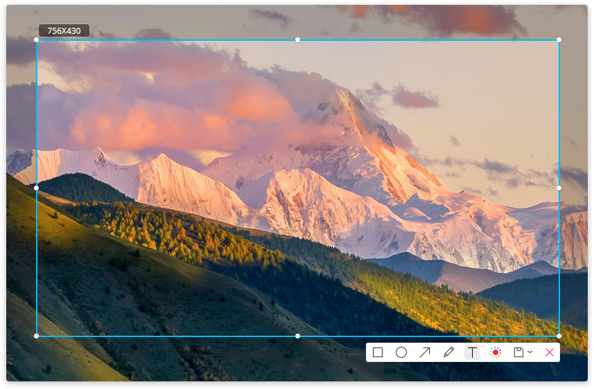

## Guide|../common/icon_guide.svg|

You can run or exit Deepin Screenshot by the following operations. A shortcut also can be created.

### Run Deepin Screenshot

1. Click on  on dock to enter launcher interface.
2. Find  to click on, you can:

 - Click on **Send to desktop** to create a desktop shortcut.
 - Click on **Send to dock** to fix it on dock.
 - Click on **Add to startup** to add it to startup, it will automatically run when the system starts up.

> : Press ++ on keyboard to quickly run Deepin Screenshot, and you can take a screenshot of submenu.

### Delay Screenshot

Delay screenshot reserves 5 seconds for you to prepare, which helps you to capture the most precise moments.

You can do the following steps to delay screenshot:

1. Press + on keyboard.
2. In the upper right corner of the screen, you will see the prompt "Deepin Screenshot will start after 5 seconds".
3. It will automatically enter the screenshot mode after 5 seconds, and then the entire screen will go dark.

> : If you have fixed Deepin Screenshot on Dock, right click on  on Dock, and then select ** Delay Screenshot** to delay the capturing.

### Exit Deepin Screenshot

In screenshot mode, you can exit Deepin Screenshot by the following ways:

* Press  on keyboard.

* Right click and select **Exit**.

* Click on  to directly exit.

> : There will be a prompt to conform if you press  after edited.

## Shortcuts|../common/icon_shortcutkey.svg|

It will save you both time and efforts to operate with shortcuts.

1. In the screenshot mode, pressing the ++ to open shortcuts preview interface.
2. In the shortcuts preview interface, you can view all the shortcuts.

<table class="block2">

    <caption>Start/Screenshot</caption>

    <tbody>

        <tr>

            <td>Quick start</td>

            <td>Ctrl+Alt+A</td>

        </tr>

        <tr>

            <td>Full screenshot</td>

            <td>Print</td>

        </tr>

        <tr>

            <td>Delay screenshot</td>

            <td>Ctrl+Print</td>

        </tr>

        <tr>

            <td>Undo</td>

            <td>Ctrl+Z</td>

        </tr>

        <tr>

            <td>Exit</td>

            <td>Esc</td>

        </tr>

        <tr>

            <td>&nbsp;</td>

            <td>&nbsp;</td>

        </tr>

    </tbody>

</table>

<table class="block2">

    <caption>Painting</caption>

    <tbody>

        <tr>

            <td>Rectangle</td>

            <td>Alt+1</td>

        </tr>

        <tr>

            <td>Ellipse</td>

            <td>Alt+2</td>

        </tr>

        <tr>

            <td>Arrow</td>

            <td>Alt+3</td>

        </tr>

        <tr>

            <td>Pencil</td>

            <td>Alt+4</td>

        </tr>

        <tr>

            <td>Text</td>

            <td>Alt+5</td>

        </tr>

        <tr>

            <td>Color</td>

            <td>Alt+6</td>

        </tr>

    </tbody>

</table>

<table class="block2">

    <caption>Size Adjustment</caption>

    <tbody>

        <tr>

            <td>Increase height up</td>

            <td>Ctrl+Up</td>

        </tr>

        <tr>

            <td>Increase height down</td>

            <td>Ctrl+Down</td>

        </tr>

        <tr>

            <td>Increase width left</td>

            <td>Ctrl+Left</td>

        </tr>

        <tr>

            <td>Increase width right</td>

            <td>Ctrl+Right</td>

        </tr>

        <tr>

            <td>Decrease height up</td>

            <td>Ctrl+Shift+Up</td>

        </tr>

        <tr>

          <td>Decrease height down</td>

          <td>Ctrl+Shift+Down</td>

        </tr>

        <tr>

            <td>Decrease width left</td>

            <td>Ctrl+Shift+Left</td>

        </tr>

        <tr>

          <td>Decrease width right</td>

          <td>Ctrl+Shift+Right</td>

        </tr>

    </tbody>

</table>

<table class="block2">

    <caption>Save</caption>

    <tbody>

        <tr>

            <td>Save</td>

            <td>Ctrl+S</td>

        </tr>

        <tr>

            <td>Copy to Clipboard</td>

            <td>Ctrl+C</td>

        </tr>

        <tr>

            <td>&nbsp;</td>

            <td>&nbsp;</td>

        </tr>

        <tr>

          <td>&nbsp;</td>

          <td>&nbsp;</td>

        </tr>

        <tr>

            <td>&nbsp;</td>

            <td>&nbsp;</td>

        </tr>

        <tr>

          <td>&nbsp;</td>

          <td>&nbsp;</td>

        </tr>

        <tr>

            <td>&nbsp;</td>

            <td>&nbsp;</td>

        </tr>

        <tr>

          <td>&nbsp;</td>

          <td>&nbsp;</td>

        </tr>

    </tbody>

</table>

## Select Screenshot Area|../common/icon_screenshotarea.svg|

Currently there are three kinds of areas commonly captured: the full screen, program-window and customized area. When you select the relevant area to be captured, there will be a blue border around the screenshot area and highlight displayed.

> : When the computer is in multi-screen display mode, you can use Deepin Screenshot to capture areas on different screens.

### Fullscreen Selection

Fullscreen selection is to recognize the whole screen of current display.

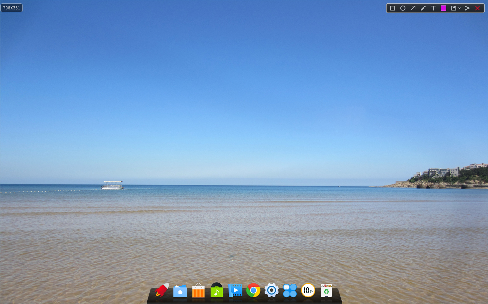

You can select fullscreen by the following steps:

1. Press ++ on keyboard to enter the screenshot mode.
2. Move the mouse pointer onto the desktop and Deepin Screenshot will select the entire screen automatically. The size of the current screenshot area will be shown in upper left corner.
3. Click on the desktop and the toolbar will pop up in the upper right corner.
4. If you want to exit screenshot, please click on  on the toolbar or right click to select **Exit**.

> : You also can right click on  on Dock to select **Full Screenshot** or Press  on keyboard.

### Program Window Selection

Program window selection is to automatically recognize the current application window.

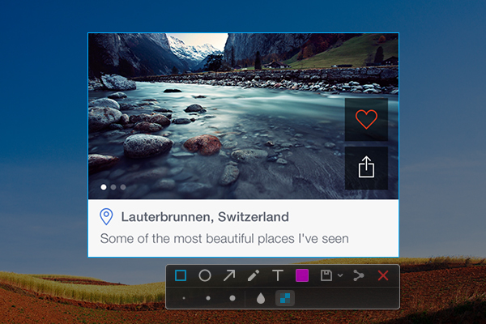

You can select program window by the following steps:

1. Press ++ on keyboard to enter the screenshot mode.
2. Move the mouse pointer over the running application window. Deepin Screenshot will select the window automatically and shows the size of the current screenshot area in upper left corner.
3. Click on the window and the toolbar will pop up in the lower right corner.
4. If you want to exit screenshot, please click on  on the toolbar or right click to select **Exit**.

### Area Customization

Area customization is to freely select the area to be captured by dragging the mouse.

You can customize area by the following steps:

1. Press ++ on keyboard to enter the screenshot mode.
2. Press and hold down the left mouse button, and drag the mouse to select the screenshot area. The size of the current screenshot area will be displayed in real time in upper left corner.
3. Release the left mouse button to finish capturing screenshot, and then the toolbar will pop up in the lower right corner of the screenshot area.
4. If you want to exit screenshot, please click on  on the toolbar or right click to select **Exit**.

## Adjust Screenshot Area|../common/icon_adjustscreenshot.svg|

You can do fine adjustments to the screenshot area, for example, enlarging or reducing the captured scope, moving the screenshot and so on.

### Enlarge/Reduce Screenshot Area

Position the mouse pointer over the blue border of the screenshot area, then the mouse pointer will become . You can:

* Press and hold down the left mouse button, and drag the mouse to enlarge or reduce the screenshot area.

* Press + or  on keyboard to extend the screenshot area up or down, and press + or  on keyboard to extend the screenshot area left or right.

### Move Screenshot

Position the mouse pointer over the screenshot area, and then the mouse pointer will become . You can:

* Press and hold down the left mouse button, and drag the mouse to move the screenshot area.

* Press  or  on keyboard to move the screenshot area up or down, and press  or  on keyboard to move the screenshot area left or right.

## Edit Screenshot|../common/icon_editscreenshot.svg|

The image editing features that come with Deepin Screenshot include graphics marking and text annotation, etc, which can fully meet your daily needs of processing images. You can also use mosaic on images to protect your privacy.

You can do one of the following operations to edit screenshots:

* Click on the tool icons on toolbar to edit.

* Quickly switch between various editing tools through shortcuts.

* Right click to choose the editing tools after selecting the screenshot area.

### Toolbar Description

While capturing screenshots, you can click on the icons on toolbar to complete various operations. Run Deepin Screenshot and the toolbar will automatically appear below the screenshot area after selected the screenshot area. And you also can right click to select tools. 

> : If you have already set line width, font size and so on in the extended panel of toolbar, Deepin Screenshot will remember them. When you start Deepin Screenshot again, the settings will be used by default and you can also reset.

<table class="block1">

    <caption>Icon Description</caption>

    <tbody>

        <tr>

            <td></td>

            <td>Rectangle</td>

            <td class="blank"></td>

            <td></td>

            <td>Ellipse</td>

	    <td class="blank"></td>

            <td></td>

            <td>Arrow</td>

        </tr>

          <tr>

            <td></td>

            <td>Pencil</td>

            <td class="blank"></td>

            <td></td>

            <td>Text</td>

            <td class="blank"></td>

            <td></td>

            <td>Color</td>

        </tr>

          <tr>

            <td></td>

            <td>Save</td>

            <td class="blank"></td>

            <td></td>

            <td>Exit</td>

             <td class="blank"></td>

            <td>&nbsp;</td>

            <td>&nbsp;</td>

        </tr>

    </tbody>

</table>

### Drawing

You can draw some simple graphics in the captured images, such as rectangle, ellipse, and so on.

 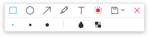

#### Rectangle

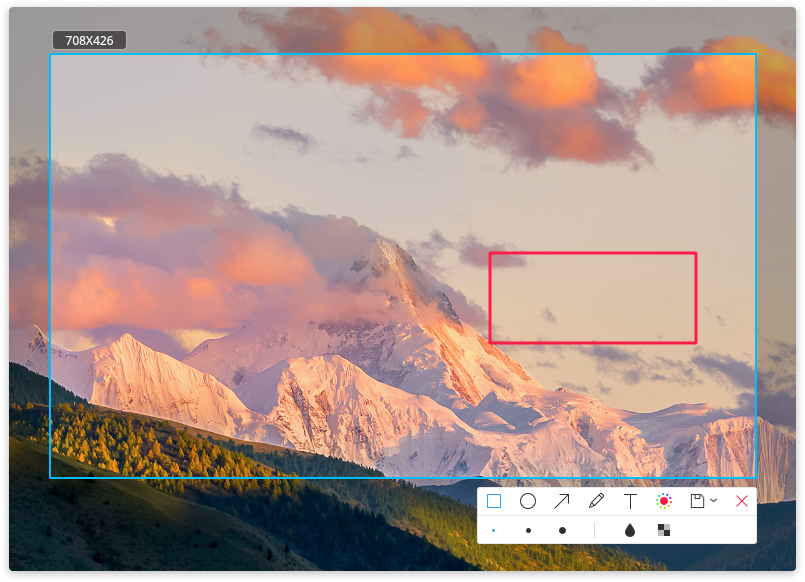

1. Click on  in the toolbar.
2. In the extended panel of the toolbar, choose width of the rectangle border line.
3. Place the mouse pointer on the screenshot area, and then the mouse pointer will become .
4. Press and hold down the left mouse button, drag the mouse to finish drawing.
5. If the screenshot includes personal private information, please click on  or  in the extended panel of the toolbar to blur.

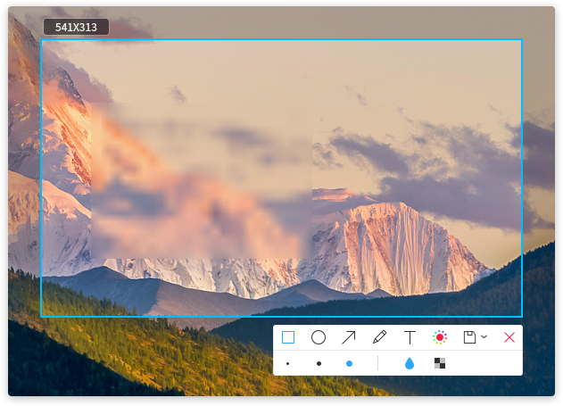

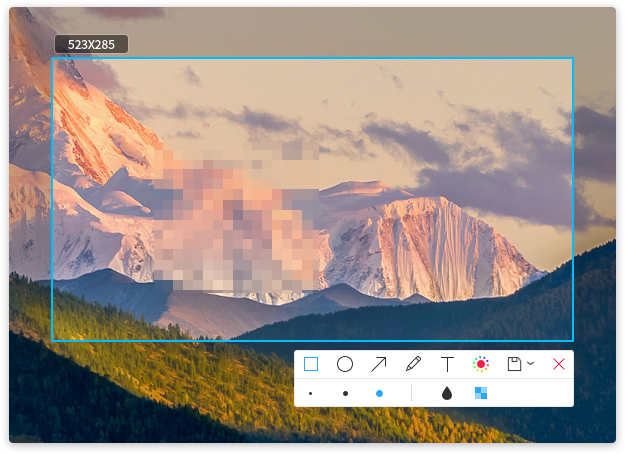

> : Press and hold the  on keyboard, and then select  to draw a square.

#### Ellipse

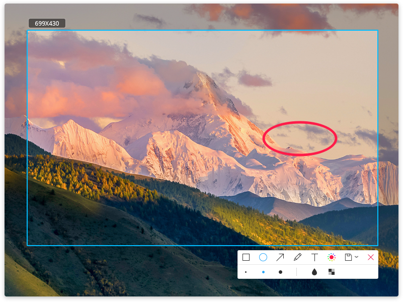

1. Click on  in the toolbar.
2. In the extended panel of the toolbar, choose width of the ellipse border line.
3. Place the mouse pointer on the screenshot area, and then the mouse pointer will become .
4. Press and hold down the left mouse button, drag the mouse to finish drawing.
5. If the screenshot includes personal private information, please click on  or  in the extended panel of the toolbar to blur.

> : Press and hold the  on keyboard, and then select  to draw a circle.

#### Arrow

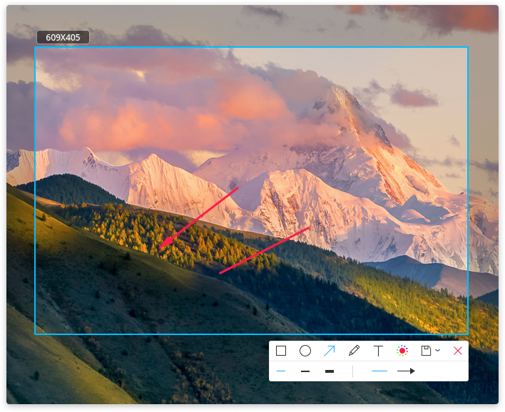

1. Click on  in the toolbar.
2. In the extended panel of the toolbar, choose width of the arrow border line.
3. Click on  or  to switch between straight line and arrow.
4. Place the mouse pointer on the screenshot area, and then the mouse pointer will become .
5. Press and hold down the left mouse button, drag the mouse to finish drawing.

> : Press and hold  on keyboard, and then select  or  to draw a straight line or arrow in the horizontal or vertical direction.

#### Pencil

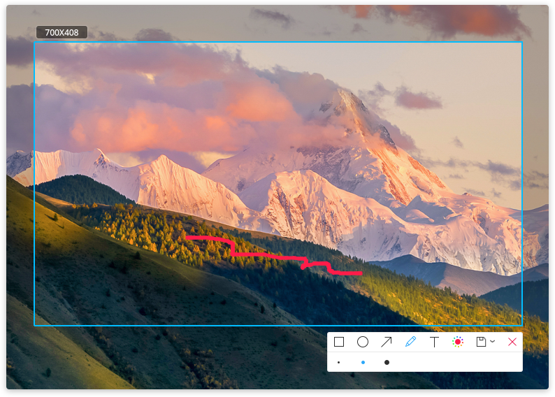

1. Click on  in the toolbar.
2. In the extended panel of the toolbar, choose width of the pencil.
3. Place the mouse pointer on the screenshot area, and then the mouse pointer will become .
4. Press and hold down the left mouse button, drag the mouse to finish drawing.

### Modify Graphics

If you have drawn other graphics in the screenshots, you can modify and move them.

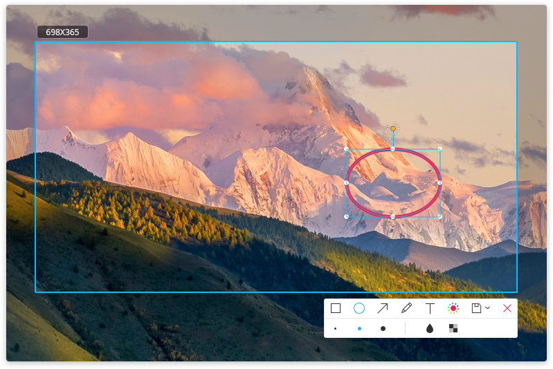

#### Move Graphics

1. Position the mouse pointer over the sideline of the graphics, and then the mouse pointer become .
2. Press and hold down the left mouse button, and you can move the graphics to any place in the screenshot area.
3. Press  or  on keyboard to move the graphics up and down, and press  or  on keyboard to move the graphics left and right.

#### Edit Graphics

1. Position the mouse pointer over the sideline of graphics.
2. Click to enter the editing mode of graphics. You can:

   - Press  on keyboard to delete graphics.

   - Press + on keyboard to return to the previous step.

   - Position the mouse pointer on the editing box, and then the mouse pointer becomes . You can enlarge or reduce the graphic area by dragging the mouse pointer.

   - Press + or  on keyboard to extend the graphic area up or down, and press + or  on keyboard to extend the graphic area left or right.

   - Position the mouse pointer on  of the editing box, and then the mouse pointer becomes . You can rotate graphics by dragging the mouse pointer .

3. Click outside the editing box to exit the editing mode.

### Add Text Annotations

Supplement and add descriptions to the captured images, thus to help others understand them more clearly.

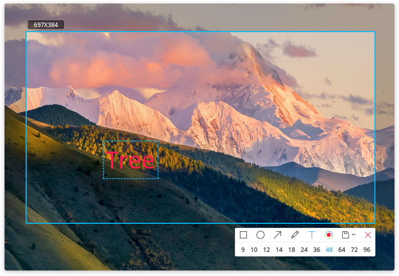

1. Click on  in the toolbar below the screenshot area,.
2. In the extended panel of the toolbar, select a needed font size.
3. Place the mouse pointer on the captured images, and then the mouse pointer becomes .
4. Click where you want to add an annotation, and a text box to be input will appear.
5. Enter text in the text box.

> : In the text editing mode, it will not auto wrap, you need to press Enter.

### Modify Text Annotations

If you have added a text annotation, you can modify and move the text annotation.

#### Move Text Annotations

1. Position the mouse pointer over the text, and then the mouse pointer becomes .
2. Press and hold down the left mouse button, and you can move the text to any place in the screenshot area.

#### Edit Text Annotations

1. Position the mouse pointer over the text.
2. Click to enter text-editing mode. You can:

   - Press  on keyboard to delete the text annotations.

   - Press + on keyboard to return to the previous step.

   - Modify the text in the text box.

3. Click outside the text box to exit editing mode.

### Set Colors

Deepin Screenshot totally provides 16 colors for you. You can choose different colors to mark.

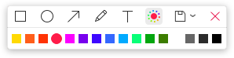

1. In the toolbar below the screenshot area, click on .
2. Select a color in the extended panel of the toolbar.

> : The default color is red. When you select a new color, it will be shown in a circle, the color icon in toolbar will be changed in real time and so does the color of other tools.

## Save Screenshot|../common/icon_savescreenshot.svg|

Save captured images as material for future use!

### Saving Method

You can save captured images by the following ways:

* Press + on keyboard to save.

* In the captured images, right click and select **Save** or double-click the mouse to save.

> : After successfully saving a screenshot, you can see a prompt in the upper right corner of the desktop. Click on **View** to open the storing folder.

### Saving Path

You can click the drop-down options of  in the toolbar below the screenshot area:

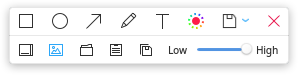

* Select  to save picture to desktop.

* Select  to auto save picture to the folder selected last time, the default directory is desktop at the first time.

* Select  to save picture to specified folder.

* Select  to copy picture to clipboard.

* Select  to save picture to system default folder and copy to clipboard.

> : You can adjust the quality of the saved pictures by dragging the slider left or right.

### Saving Format

The captured images will be named after "DeepinScreenshot+image name+date and time".

The detailed kinds are in the following:

* When taking a screenshot of the window, the saving format is "DeepinScreenshot+ window name+date and time".

* When taking a screenshot of desktop components (such as Dock, Launcher and Control Center), the saving format is "DeepinScreenshot+desktop component name+date and time".

* When taking a screenshot of free area, the saving format is "DeepinScreenshot+areaname+date and time".

